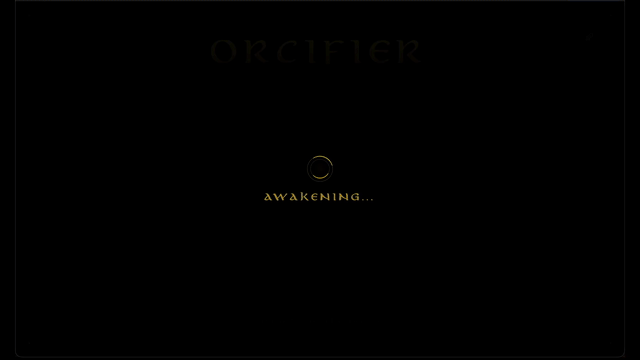

# ORCIFIER

**Immersive Real-Time Visage Transformation**

Orcifier blends advanced computer vision with high-fidelity 3D rendering to seamlessly overlay fantasy masks onto the user's face. Utilizing GPU-accelerated tracking, it anchors digital prosthetics to facial expressions with zero perceived latency.



---

## Capabilities

### Instant Transfiguration
The application tracks 468 facial landmarks in real-time, mapping a dynamic mesh that mimics every smile, frown, and grimace.

### The Beastiary
Select from a curated collection of high-resolution textures:
- **Orc** (Variants I & II)
- **Goblin** (Variants I & II)
- **Lizardfolk** (Variants I & II)

### Artifact Settings
A sleek, custom-built interface allows for live manipulation of the illusion:
- **Race**: Instantly swap between creature skins.
- **Scale Projection**: Fine-tune the mesh size to perfectly fit your facial structure.

---

## Technical Grimoire

Constructed upon a modern, high-performance stack:

| Component | Technology | Description |
|-----------|------------|-------------|
| **Core** | SvelteKit + Svelte 5 | Reactive state management using Runes. |
| **Renderer** | Three.js + Threlte | Declarative 3D scene graph and PBR materials. |
| **Vision** | MediaPipe | Client-side, GPU-accelerated face landmark detection. |
| **Aesthetics** | Tailwind CSS v4 | Utility-first styling with a custom fantasy design system. |

---

## Initiation Ritual

### Prerequisites
- Node.js or Bun runtime
- A webcam-enabled device

### Summoning
1. **Clone the Repository**
   ```bash
   git clone https://github.com/66HEX/orcifier.git
   cd orcifier
   ```

2. **Prepare the Environment**
   ```bash
   bun install
   ```

3. **Begin the Ritual**
   ```bash
   bun run dev
   ```

4. **Open the Portal**
   Access the application at `http://localhost:5173` and grant the necessary optical permissions.

---

## Command Runes

| Command | Effect |
|---------|--------|
| `bun run dev` | Ignites the local development server. |
| `bun run build` | Compiles the artifacts for production. |
| `bun run preview` | Previews the compiled build. |
| `bun run check` | Verifies type integrity via Svelte Check. |

---

## License

MIT
